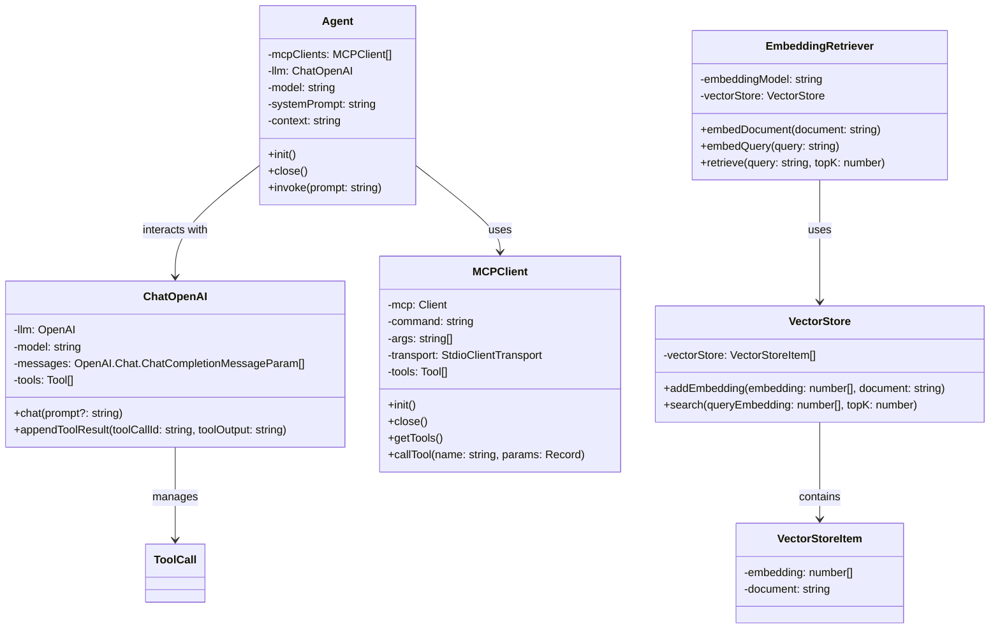

# LLM + MCP + RAG

## 目标

- **Augmented LLM** (Chat + MCP + RAG)
- 不依赖框架
    - LangChain, LlamaIndex, CrewAI, AutoGen
- **MCP**
    - 支持配置多个MCP Serves
- **RAG** 极度简化板
    - 从知识中检索出有关信息，注入到上下文
- **任务**
   - 阅读网页 → 整理一份总结 → 保存到文件
   - 本地文档 → 查询相关资料 → 注入上下文

## **The augmented LLM**

- [Building Effective Agents](https://www.anthropic.com/engineering/building-effective-agents)




## **依赖**

```bash
git clone git@github.com:HQ-YYK/python-uv-template.git
uv venv  # 创建虚拟环境
# 激活虚拟环境（根据你的操作系统）
# 在Windows上：
# .venv\Scripts\activate
# 在Unix或MacOS上：
# source .venv/bin/activate

# 使用uv安装依赖
uv sync
uv add python-dotenv openai mcp rich
```
| 依赖包名称 | 描述 | 主要用途 |
|------------|------|---------|
| **python-dotenv** | 环境变量管理库 | 从 `.env` 文件加载环境变量到 `process.env` 中，用于管理敏感配置（如 API 密钥） |
| **openai** | OpenAI 官方 Node.js SDK | 调用 OpenAI 的 API（如 GPT、DALL-E 等），实现 AI 对话、文本生成等功能 |
| ****mcp** | Model Context Protocol (MCP) 的官方 SDK | 用于构建或连接 MCP 服务器/客户端，实现与 AI 模型的安全上下文交互和工具调用 |
| **rich** | 终端字符串样式库 | 在命令行输出中添加颜色、样式（如加粗、背景色），提升可读性和美观度 |


## LLM

- [OpenAI API](https://platform.openai.com/docs/api-reference/chat)

## MCP

- [MCP 架构](https://modelcontextprotocol.io/docs/concepts/architecture)
- [MCP Client](https://modelcontextprotocol.io/quickstart/client)
- [Fetch MCP](https://github.com/modelcontextprotocol/servers/tree/main/src/fetch)
- [Filesystem MCP](https://github.com/modelcontextprotocol/servers/tree/main/src/filesystem)

## RAG

- [Retrieval Augmented Generation](https://scriv.ai/guides/retrieval-augmented-generation-overview/)
    - 译文: https://www.yuque.com/serviceup/misc/cn-retrieval-augmented-generation-overview
- 各种Loaders: https://python.langchain.com/docs/integrations/document_loaders/
- [硅基流动](https://cloud.siliconflow.cn/models)
    - 邀请码： **x771DtAF**
- [json数据](https://jsonplaceholder.typicode.com/)

## 向量

- 维度
- 模长
- 点乘 Dot Product
    - 对应位置元素的积，求和
- 余弦相似度 cos
    - 1 → 方向完全一致
    - 0 → 垂直
    - -1 → 完全相反


